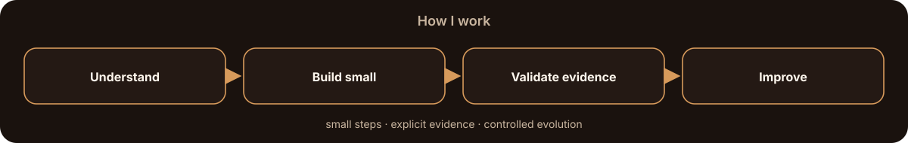
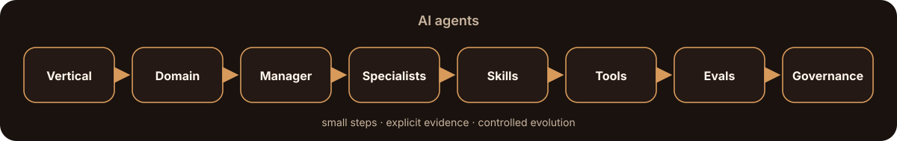
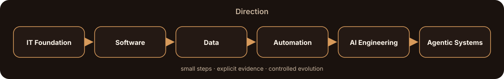

### Software · Data · Automation · AI Engineering

I build systems at the intersection of <b>software, data, automation and artificial intelligence</b>, with a strong focus on clarity, reliability, traceability and practical engineering.

<!-- typing-principles:start -->

<!-- typing-principles:end -->

 

Warm minimal workspace · focused tools · deliberate systems

---

### About me

**AI-native development · intelligent automation · software systems.**

My foundation is in IT and software. I use AI as an additional engineering layer — not as a replacement for fundamentals.

I am especially interested in building systems that are **small enough to understand, reliable enough to trust, and structured enough to evolve**.

---

### How I work

I organize work in short, goal-oriented cycles and develop systems through **small, verifiable increments**. I prefer explicit decisions, observable behavior and evidence over assumptions.

#### Software Engineering

My software workflow combines **Scrum, incremental DevOps, DevSecOps, thin slices and evidence-driven development**. Backlogs and sprint goals organize the work; security, validation and traceability stay inside the engineering cycle from the beginning.

<b>Methodology</b>

 

**Scrum**  
I use a prioritized backlog, explicit sprint goals, reviews and retrospectives to keep work bounded and continuously adjustable.

**Incremental DevOps**  
Each change is implemented in a small scope, tested locally, observed in execution, corrected when needed and versioned before the next evolution.

**DevSecOps**  
Security, trust boundaries and validation are considered from the beginning instead of being added after implementation.

**Thin Slices**  
Large systems are developed through small end-to-end increments that can already be executed, tested and evaluated.

**Evidence-Driven Development**  
A solution is accepted through evidence: tests, metrics, outputs, logs and observed behavior.

**Separation of Concerns**  
Input, validation, business logic, persistence and interfaces remain separated so each layer can evolve independently.

**Reproducibility & Logical Idempotency**  
The same valid input should reproduce the same logical behavior and results.

**Traceability**  
Important outputs should be traceable back to their inputs, transformations and versions.

**Fail-Safe / Fail-Closed**  
When something cannot be validated safely, preserve it, isolate it and make the failure visible instead of guessing.

**Pragmatic Architecture**  
Requirements determine architecture. Technology is introduced only when the problem justifies it.

 

#### AI Agents

I approach AI agents as **specialized systems**, not generic assistants. The architecture starts from a vertical and its domain, then assigns clear responsibilities, knowledge, skills, tools, evaluation and governance.

<b>Methodology</b>

 

**Vertical AI Agents**  
Start from a specific domain, workflow or professional function instead of starting from the model.

**Domain-First Design**  
Problems, responsibilities, workflows and knowledge are defined before agents and tools are selected.

**Agents by Function**  
Agents are defined by responsibility — such as Planner, Researcher, Evaluator or Visual Director — rather than by the application they use.

**Factory over Assistant**  
The objective is a coordinated production system where a manager delegates bounded work to specialized agents, skills and tools, producing artifacts that can be evaluated.

**Manager + Specialists**  
A manager interprets, decomposes, delegates and integrates work while specialized agents execute bounded responsibilities.

**Skills Architecture**  
Reusable capabilities are documented, tested and versioned independently from the agent using them.

**Human-in-the-loop AI**  
AI proposals are reviewed by a human, executed in context and compared against real evidence before they are accepted.

**Evals & QA**  
Agent behavior is evaluated for correctness, completeness, tool selection, hallucination, policy adherence and output quality.

**Governance**  
Permissions, policies, logs, approvals, auditing and versioning control how the system evolves.

**Controlled Release**  
New capabilities move through sandbox testing, evaluation and human approval before production, followed by monitoring.

 

#### Automation

I prefer to understand and validate a process manually before automating it. Automation should remove friction from a process that already makes sense — not hide a process that is still unclear.

<b>Methodology</b>

 

**Manual Before Automation**  
Execute the process manually first, understand its decisions and automate only the stable parts.

**Process Mapping**  
Every workflow is described through its trigger, inputs, rules, decisions, actions, outputs and failure paths before automation expands.

**Incremental Automation**  
Automation grows one validated step at a time instead of becoming a large opaque workflow.

**Event-Driven Workflows**  
APIs, webhooks, files, schedules, databases and user actions can trigger repeatable flows.

**Idempotency**  
Reprocessing the same valid event should not create inconsistent state.

**Retry & Recovery**  
Temporary failures should have controlled retries and clear escalation paths.

**Rollback**  
When a workflow changes state, recovery to a previous safe state should be considered.

**Human Fallback**  
Ambiguous or low-confidence situations can return to human review instead of forcing an automated decision.

**Observability**  
A workflow should make execution, inputs, outputs, errors, retries and duration visible.

**Evidence-Driven Automation**  
Automation is evaluated by measurable improvement, not simply by the fact that it runs automatically.

 

#### Shared principles

`Scrum` · `Systems Thinking` · `Evidence over Assumption` · `Security by Design` · `Traceability` · `Human Review` · `Incremental Improvement`

  

Technology should support the process — not become the process.

---

### My daily driver

&nbsp;
<picture>
<source media="(prefers-color-scheme: dark)" srcset="https://raw.githubusercontent.com/lobehub/lobe-icons/refs/heads/master/packages/static-png/dark/codex.png">

</picture>

  

Windows · VS Code · GitHub · PowerShell · Docker · Codex

---

### Core Stack

  

Python · TypeScript · Node.js · React · Astro · Tailwind CSS · Git

---

### Tools & Technologies

<h4>development</h4>

  

JavaScript · HTML5 · CSS · Linux · npm · Vite

  

<h4>data & backend</h4>

&nbsp;

&nbsp;

&nbsp;

&nbsp;

&nbsp;

&nbsp;

  

PostgreSQL · SQL · Supabase · Firebase · DuckDB · pandas · Parquet

  

<h4>ai & agents</h4>

<picture>
<source media="(prefers-color-scheme: dark)" srcset="https://raw.githubusercontent.com/lobehub/lobe-icons/refs/heads/master/packages/static-png/dark/openai.png">

</picture>
&nbsp;

&nbsp;
<picture>
<source media="(prefers-color-scheme: dark)" srcset="https://raw.githubusercontent.com/lobehub/lobe-icons/refs/heads/master/packages/static-png/dark/grok.png">

</picture>
&nbsp;

&nbsp;

  

ChatGPT · Gemini · Grok · Claude Code · Gemini CLI

  

<h4>automation & orchestration</h4>

&nbsp;

&nbsp;

&nbsp;

  

n8n · APIs · Webhooks · AI Workflows

  

<h4>thinking, design & knowledge</h4>

&nbsp;

&nbsp;

&nbsp;

&nbsp;

&nbsp;

&nbsp;

&nbsp;

  

Figma · Canva · Pinterest · Obsidian · AFFiNE · Notion · Google Drive · Miro

---

### Direction

I am strengthening the same technical foundation while moving deeper into **AI engineering, vertical agents, agentic development and intelligent automation**.

  

 

The objective is not to collect tools — it is to connect them into systems that are easier to understand, verify and improve.

---

### Analytics

  

  

  

<!-- contribution-snake:start -->
<picture>
  <source
    media="(prefers-color-scheme: dark)"
    srcset="https://raw.githubusercontent.com/eurafff/eurafff/output/github-contribution-grid-snake-dark.svg"
  />
  <source
    media="(prefers-color-scheme: light)"
    srcset="https://raw.githubusercontent.com/eurafff/eurafff/output/github-contribution-grid-snake.svg"
  />
  
</picture>
<!-- contribution-snake:end -->

---

<a href="https://x.com/raffmehmc1">X · @raffmehmc1</a>

  

Warm minimal workspace · focused tools · clear systems

